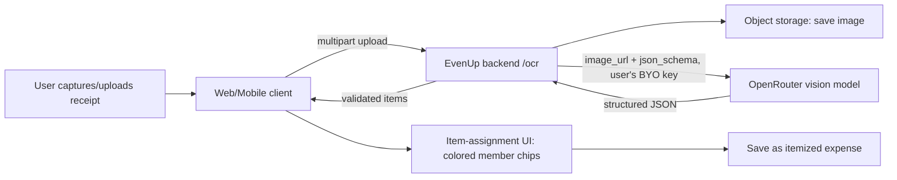
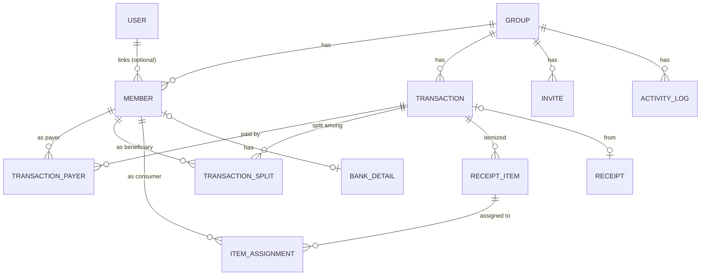

# EvenUp — Product Requirements Document

> **EvenUp** (Czech: **dlužníček**) is an open-source, self-hostable application for splitting shared
> group expenses and **minimizing the number of debts** between people. Web first, with fully
> functional iOS and Android apps. Free, no ads, no monetization.

| | |
|---|---|
| **Product name** | EvenUp (CZ: dlužníček) |
| **Document status** | Draft v1.0 — for review |
| **Last updated** | 2026-06-22 |
| **License** | MIT (open source, public GitHub repository) |
| **Languages** | Czech (default) + English |
| **Platforms** | Web (PWA) → iOS + Android (React Native / Expo) |
| **Monetization** | None. Self-hosted, free forever. |
| **Deployment target** | LNRT Coolify (Docker, auto-deploy from GitHub) |

---

## 1. Overview, Vision & Goals

### 1.1 Problem
When a group of people shares costs on a trip, in a shared flat, or at an event, tracking who paid
for what and who owes whom becomes messy. People forget amounts, lose receipts, and end up with a
tangle of small debts that nobody wants to resolve. Existing tools (Settle Up, Splitwise) solve the
core math but are closed-source, push paid tiers, and the receipt-entry step is tedious.

### 1.2 Vision
A clean, fast, bilingual (CZ/EN) expense splitter that:
- lets you add people to a group in seconds — **no account required for participants**,
- **minimizes the number of settlement payments** so people pay each other as little as possible,
- turns a **photo of a receipt** into an itemized list automatically, where you assign each item to
  people by tapping **colored initial chips**,
- generates a **Czech QR payment (SPAYD / "QR Platba")** so the debtor pays with one scan,
- is **open source and self-hostable**, so anyone can run their own instance.

### 1.3 Goals
- **G1** — Add a shared expense (manually or from a receipt photo) in under 15 seconds.
- **G2** — Always show the *minimal* set of payments needed to settle the group.
- **G3** — Make participation frictionless: virtual members, optional accounts, invite links.
- **G4** — One-scan settlement via SPAYD QR for Czech bank accounts.
- **G5** — Be genuinely cross-platform: web + iOS + Android, sharing the same domain logic.
- **G6** — Be fully open source, fully tested, and trivially self-hostable.

### 1.4 Non-Goals
- **NG1** — No payment processing. EvenUp never moves money; it only generates QR payment requests
  and records that a settlement happened. (Bank/Open-Banking integration is an explicit *future*
  consideration, not in scope.)
- **NG2** — No monetization, subscriptions, ads, or premium tiers.
- **NG3** — No accounting/tax/invoicing features.
- **NG4** — No social network features (feeds beyond the group's own activity log, friends graph).

### 1.5 Guiding principles
- **YAGNI** — ship the smallest thing that solves the real problem; resist feature creep.
- **Local-first feel** — optimistic UI, fast interactions, works offline for reading.
- **Privacy by default** — minimal PII, receipt images optionally auto-deleted, BYO API keys.
- **Everything tested** — domain logic is the heart of the app and is verified exhaustively.

---

## 2. Personas & User Stories

### 2.1 Personas
- **Organizer (Olivia)** — plans a ski trip for 6 friends, pays for the cabin and groceries, wants
  everyone to settle up afterwards with minimal fuss. Has an account, is group admin.
- **Participant (Petr)** — one of Olivia's friends. Doesn't want to install anything. Olivia adds
  him as a member; later he optionally opens an invite link to claim his profile.
- **Flatmate (Filip)** — shares ongoing household costs with 2 roommates; uses recurring expenses.
- **Self-hoster (Standa)** — runs his own EvenUp instance from the GitHub repo for his family.

### 2.2 Core user stories
- As an **organizer**, I can create a group and add members by name (with a color + initials) without
  requiring them to sign up.
- As an **organizer**, I can record an expense, choose who paid, and split it equally, by exact
  amounts, by shares/weights, by percentage, or **per item**.
- As an **organizer**, I can photograph a receipt; the app extracts the line items; I assign each
  item to one or more members by tapping their colored chips, and the split is computed.
- As **any member**, I can see the current balances and the **minimal list of payments** needed to
  settle everyone up.
- As a **debtor**, I can open a suggested payment and get a **SPAYD QR code** to pay by bank transfer,
  then mark it as paid.
- As a **participant**, I can open an invite link, claim my member profile, and (optionally) create
  an account to get notifications across my devices.
- As **anyone**, I can switch the UI between Czech and English.
- As a **traveler**, I can enter an expense in a foreign currency and have it converted to the
  group's base currency at the day's rate.

---

## 3. Domain Glossary

| Term | Definition |
|---|---|
| **Group** | A container for members and transactions (e.g., "Tatry 2026", "Byt"). Has one **base currency**. |
| **Member** | A participant in a group. May be **virtual** (name + color only) or **linked** to a User account. |
| **User** | A registered account (email + auth). Optional. One User can be linked to members in many groups. |
| **Transaction** | An expense, income, or transfer recorded in a group. |
| **Expense** | Money one or more members paid, split among beneficiaries. |
| **Income** | A negative expense (refund, group earning) that lowers total spend. |
| **Transfer / Settlement** | A direct payment from one member to another to pay down debt. |
| **Payer** | A member who paid (part of) a transaction. A transaction can have multiple payers. |
| **Beneficiary** | A member who benefits from (owes part of) a transaction. |
| **Split** | How a transaction's amount is divided among beneficiaries. |
| **Share / weight** | A relative number for split-by-shares (e.g., a couple counts as 2). |
| **Balance** | A member's net position in base currency: `total paid − total owed`. |
| **Debt minimization** | Computing the smallest set of payments that settles all balances. |
| **SPAYD** | Short Payment Descriptor — the Czech QR payment string standard ("QR Platba"). |
| **Receipt** | An uploaded image processed by OCR into structured line items. |
| **BYO key** | "Bring Your Own" OpenRouter API key supplied by the user for OCR. |

---

## 4. Functional Requirements

Requirements use **MUST / SHOULD / MAY** (RFC 2119). Each is tagged `FR-x.y`.

### 4.1 Accounts & Authentication
- **FR-1.1** Participation MUST NOT require an account. Members can exist as virtual entities.
- **FR-1.2** Users MAY create an account via **email magic link** and/or **OAuth** (Google, Apple —
  Apple required for iOS App Store).
- **FR-1.3** A logged-in User MUST be able to link/claim a member within a group via an invite link.
- **FR-1.4** A User MUST be able to view all groups they belong to across devices.
- **FR-1.5** Sessions MUST be secure (httpOnly, SameSite cookies on web; secure token storage on mobile).
- **FR-1.6** Users MUST be able to export and delete their account data (GDPR).

### 4.2 Groups & Members
- **FR-2.1** A User MUST be able to create a group with a name, optional template (Trip / Household /
  Couple / Event / Other), and a **base currency**.
- **FR-2.2** A group MUST support adding **virtual members**: display name, auto-derived initials,
  and an assigned **color** (used everywhere as the chip color).
- **FR-2.3** Each member MUST have a **default share** (weight, default 1) used to pre-fill new splits.
- **FR-2.4** Members MUST be deactivatable (not deletable) once they appear in any transaction, to
  preserve history. Members with zero transactions MAY be deleted.
- **FR-2.5** A group MUST support **invite links** (tokenized URL, optional expiry/usage limit). Opening
  a link lets a User claim a virtual member or join as a new member.
- **FR-2.6** Group members MUST have a **role**: `admin` (manage members/settings) or `member`.
- **FR-2.7** A group MUST be **archivable** once settled; archived groups are read-only but restorable.
- **FR-2.8** A group setting **"simplify debts"** MUST toggle debt minimization on/off (default: on).

### 4.3 Expenses & Income
- **FR-3.1** A user MUST be able to record an **expense** with: title, total amount, currency, date,
  category, note (optional), one or more **payers** (with per-payer amounts), and a **split** among
  beneficiaries.
- **FR-3.2** The sum of payer amounts MUST equal the transaction total (validated).
- **FR-3.3** A user MUST be able to record **income** (a negative expense) and a **transfer**
  (settlement) between two members.
- **FR-3.4** Transactions MUST be editable and deletable by admins (and by the creator), with an
  activity-log entry recorded for each change.
- **FR-3.5** Each transaction MAY attach a receipt image and/or a free note.

### 4.4 Split Types
The app MUST support these split methods for any expense:
- **FR-4.1 Equally** — divided evenly among selected beneficiaries (respecting default shares if set).
- **FR-4.2 Exact amounts** — explicit amount per beneficiary; MUST sum to the total.
- **FR-4.3 Shares / weights** — proportional to integer weights (e.g., 2:1:1).
- **FR-4.4 Percentage** — proportional to percentages; MUST sum to 100%.
- **FR-4.5 Itemized** — per-line-item assignment (see OCR §4.5); each item assigned to one or more
  members; shared items split evenly among their assignees; the expense total equals the sum of items
  (+ optional tax/tip allocation).
- **FR-4.6** Rounding MUST be deterministic and **cent-accurate**: the sum of computed shares MUST
  equal the total exactly; residual cents are distributed by a fixed, documented rule (largest
  remainder method, stable by member order).

### 4.5 OCR Receipt Scanning
- **FR-5.1** A user MUST be able to capture or upload a receipt image (web file/camera; mobile native
  camera).
- **FR-5.2** The image MUST be sent through the EvenUp backend to **OpenRouter**, using the **user's
  own API key (BYO)**, with a strict JSON-schema `response_format` (structured output).
- **FR-5.3** The OCR result MUST be parsed into a structured list: merchant, date, currency, and line
  items `{ name, quantity, unitPrice, totalPrice, taxRate? }`, plus subtotal/tax/tip/total and a
  per-result confidence.
- **FR-5.4** The UI MUST present each extracted item with the group's **colored member chips**; tapping
  a chip toggles whether that member shares the item. Items can be edited (name/price/qty), merged,
  split, or deleted before saving.
- **FR-5.5** The user MUST be able to assign tax/tip/service either proportionally across items or to
  specific members.
- **FR-5.6** OCR MUST be **optional and equivalent** to manual entry — manual entry is always available
  and never blocked by OCR.
- **FR-5.7** The selected OCR model MUST be configurable (default a strong, low-cost vision model;
  see §6). The backend MUST handle model errors, timeouts, low confidence, and malformed JSON
  gracefully and fall back to manual entry.
- **FR-5.8** Receipt images MUST be stored in object storage; a group/instance setting MUST allow
  **auto-deletion** of the image after successful extraction (privacy).

### 4.6 Balances & Debt Minimization
- **FR-6.1** The app MUST compute each member's **net balance** in the group's base currency from all
  transactions (paid − owed, including settlements).
- **FR-6.2** When "simplify debts" is on, the app MUST compute the **minimal set of payments** that
  brings every balance to zero (see algorithm §5).
- **FR-6.3** When off, the app MUST show **direct debts** only (who owes whom from each expense).
- **FR-6.4** Balances and suggested payments MUST recompute automatically whenever transactions change.
- **FR-6.5** The app MUST clearly visualize debts (a list and a simple graph, mirroring the Settle Up
  before/after concept).

### 4.7 Settlements (SPAYD QR + Mark Paid)
- **FR-7.1** For each suggested payment, the app MUST let the debtor generate a **SPAYD QR code**
  when the creditor has a Czech IBAN saved (amount, currency, message, optional variable symbol).
- **FR-7.2** Members MAY save bank details (IBAN, optional name/VS) used only to build SPAYD strings.
  Bank details MUST be optional and editable.
- **FR-7.3** A user MUST be able to **mark a payment as settled** (recording a transfer transaction),
  with method `cash | bank | qr`. This updates balances immediately.
- **FR-7.4** If a creditor has no IBAN, the app MUST still allow recording cash/manual settlement.
- **FR-7.5** Settlements MUST appear in the activity log and be reversible.

### 4.8 Multi-Currency & FX
- **FR-8.1** A group MUST have a **base currency**; expenses MAY be entered in any supported currency.
- **FR-8.2** Non-base expenses MUST be converted to base currency using the **day's exchange rate**,
  fetched from a configurable FX source and cached daily.
- **FR-8.3** A user MUST be able to **override** the rate for an expense and to **lock a rate** for a
  group/trip period (so a vacation uses one consistent rate).
- **FR-8.4** Amounts MUST be displayed in both the entered currency and the base currency where useful.
- **FR-8.5** If the FX source is unavailable, the last cached rate MUST be used with a clear indicator;
  manual entry MUST always be possible.

### 4.9 Activity History
- **FR-9.1** Each group MUST have an **activity log** of create/edit/delete/settle events with actor,
  timestamp, and a human-readable description (localized).
- **FR-9.2** The log MUST be filterable by member and by type.

### 4.10 Internationalization (CZ / EN)
- **FR-10.1** The entire UI MUST be available in **Czech and English**; Czech is the default.
- **FR-10.2** Language MUST be switchable at runtime and persisted per user/device.
- **FR-10.3** Numbers, currencies, and dates MUST be formatted per locale (e.g., `1 234,50 Kč`).
- **FR-10.4** All user-facing strings MUST come from message catalogs (no hard-coded text).
- **FR-10.5** OCR prompts SHOULD instruct the model in the receipt's likely language; extraction MUST
  work for Czech receipts (diacritics, `Kč`, comma decimals).

### 4.11 Notifications (mobile-first, later web)
- **FR-11.1** Mobile apps MUST support **push notifications** for: added/edited expense affecting you,
  a settlement request, and a debt reminder.
- **FR-11.2** Notifications MUST be per-group mutable and respect a global opt-out.

### 4.12 Recurring & Categories (later phase)
- **FR-12.1** A user SHOULD be able to mark an expense **recurring** (interval, auto-create + notify).
- **FR-12.2** Expenses SHOULD have **categories** with icons; the group SHOULD show simple spend stats.

---

## 5. Debt-Minimization Algorithm

### 5.1 Concept
The app models everyone's **net balance** in base currency. People with a positive balance are owed
money (creditors); negative balances owe money (debtors). The goal is to settle all balances with the
**fewest payments**. This collapses indirect chains: if Jayne owes Zoe and Zoe owes Kaylee the same
amount, Zoe drops out and **Jayne pays Kaylee directly** — exactly the behavior in the reference image.

```
Before (direct debts)          After (minimized)
  Jayne →100→ Zoe →100→ Kaylee     Jayne →100→ Kaylee
```

### 5.2 Algorithm (greedy min-cash-flow)
```
1. Compute net[m] for every member m  =  sum(paid) − sum(owed)   (in base currency, integer minor units)
2. Split members into:
     debtors   = { m : net[m] < 0 }   (sorted by amount, most negative first)
     creditors = { m : net[m] > 0 }   (sorted by amount, most positive first)
3. While debtors and creditors remain:
     d = largest debtor,  c = largest creditor
     pay = min(|net[d]|, net[c])
     emit payment  d → c  of  pay
     net[d] += pay ;  net[c] -= pay
     drop any member whose net == 0
4. The emitted payments are the suggested settlements.
```
- Produces at most `n − 1` payments for `n` non-zero members, which is optimal in the common case.
- **Why greedy, not exact optimal:** the true "minimum number of transactions" problem is NP-hard
  (subset-sum / partition). Greedy min-cash-flow is what Settle Up and Splitwise use; it is fast,
  deterministic, and yields the minimal count in practically all real groups. (An exact optimizer is
  explicitly out of scope.)

### 5.3 Requirements
- Implemented in **`packages/core`** as a **pure, side-effect-free function** operating on integer
  **minor units** (no floating point) to avoid rounding drift.
- MUST be deterministic given the same input (stable member ordering for ties).
- MUST be covered by unit tests **and property-based tests** (e.g., for any random balance set summing
  to zero, the emitted payments settle everyone to zero and count ≤ n−1).

### 5.4 Worked example
Net balances: Jayne −100, Zoe 0, Kaylee +100 → output: **Jayne → Kaylee : 100**. Zoe, being net 0,
emits no payment, reproducing the reference image.

---

## 6. OCR Architecture

### 6.1 Flow


### 6.2 OpenRouter integration
- Backend calls OpenRouter's chat completions endpoint with a **multimodal message** (`image_url`
  content part) and `response_format: { type: "json_schema", json_schema: { strict: true, ... } }`.
- **BYO key:** the user's OpenRouter API key is stored **encrypted at rest** (AES-GCM, server-managed
  key) and used only server-side for that user's requests. It is never returned to the client after
  saving.
- **Model:** configurable per user/instance. **Default: a strong, low-cost vision model** suitable for
  receipts (recommended default `google/gemini-2.5-flash`; viable alternatives selectable via
  OpenRouter routing, e.g. `openai/gpt-*` vision, `anthropic/claude-*` vision, `qwen/qwen-2.5-vl-*`).
  The PRD does not hard-code a single model; the implementation MUST make it a configurable setting
  with a sensible default and document cost trade-offs.
- **Cost:** because keys are BYO, OCR cost is borne by each user. The backend SHOULD expose token/usage
  info from OpenRouter responses so users can see their spend.

### 6.3 Extraction JSON schema (illustrative)
```json
{
  "type": "object",
  "additionalProperties": false,
  "required": ["currency", "items", "total", "confidence"],
  "properties": {
    "merchant":  { "type": ["string", "null"] },
    "date":      { "type": ["string", "null"], "description": "ISO 8601 if present" },
    "currency":  { "type": "string", "description": "ISO 4217, e.g. CZK" },
    "items": {
      "type": "array",
      "items": {
        "type": "object",
        "additionalProperties": false,
        "required": ["name", "quantity", "totalPrice"],
        "properties": {
          "name":       { "type": "string" },
          "quantity":   { "type": "number" },
          "unitPrice":  { "type": ["number", "null"] },
          "totalPrice": { "type": "number" },
          "taxRate":    { "type": ["number", "null"] }
        }
      }
    },
    "subtotal":   { "type": ["number", "null"] },
    "tax":        { "type": ["number", "null"] },
    "tip":        { "type": ["number", "null"] },
    "total":      { "type": "number" },
    "confidence": { "type": "number", "description": "0..1" }
  }
}
```

### 6.4 Robustness requirements
- Validate the model output against the schema (zod) **after** OpenRouter's strict mode; on mismatch,
  retry once, then fall back to manual entry with whatever partial data is available.
- Enforce a request **timeout** and a max image size; downscale large images client-side before upload.
- Reconcile: if `sum(items) ≠ total`, surface the discrepancy and let the user fix it before saving.
- No real OpenRouter calls in CI — the adapter is tested against recorded fixtures (see §10).

---

## 7. Data Model

### 7.1 Entity-relationship overview


### 7.2 Key entities (fields abbreviated)
- **User** — `id, email, name, avatarUrl, locale, createdAt`. Settings: `defaultCurrency,
  openRouterKeyEncrypted, ocrModel`.
- **Group** — `id, name, template, baseCurrency, simplifyDebts(bool), createdBy, createdAt,
  archivedAt`.
- **Member** — `id, groupId, displayName, initials, color, defaultShare(int), role, isActive,
  userId(nullable)`.
- **BankDetail** — `id, memberId, iban, recipientName?, variableSymbol?`.
- **Invite** — `id, groupId, token, createdBy, expiresAt?, maxUses?, usedCount`.
- **Transaction** — `id, groupId, type(expense|income|transfer), title, note?, currency,
  totalMinorUnits, exchangeRateToBase, date, category?, splitType, createdBy, createdAt,
  receiptId?`. For transfers: `fromMemberId, toMemberId, method, settledAt`.
- **TransactionPayer** — `transactionId, memberId, amountMinorUnits`.
- **TransactionSplit** — `transactionId, memberId, shareWeight?, exactMinorUnits?, percentage?,
  computedMinorUnits`.
- **Receipt** — `id, groupId, transactionId?, storageKey, ocrModel, status, rawJson, merchant?,
  detectedCurrency?, detectedTotalMinorUnits?, confidence, createdAt`.
- **ReceiptItem** — `id, transactionId, name, quantity, unitPriceMinorUnits?, totalMinorUnits,
  taxRate?`.
- **ItemAssignment** — `receiptItemId, memberId` (many-to-many; shared items split evenly).
- **FxRate** — `base, quote, rate, date, source` (+ optional per-group lock).
- **ActivityLog** — `id, groupId, actorId, action, payloadJson, createdAt`.

### 7.3 Money handling
- All monetary values stored as **integer minor units** (e.g., haléře/cents) with an explicit currency.
- No floating-point arithmetic in split or settlement math; conversions use rational/decimal helpers.

---

## 8. System Architecture

### 8.1 Monorepo layout
```
evenup/
  apps/
    web/        # Next.js (App Router), PWA
    mobile/     # Expo / React Native (iOS + Android)
  packages/
    core/       # PURE domain logic: split math, debt minimization, FX, SPAYD — platform-agnostic
    api/        # tRPC routers + server logic
    db/         # Prisma schema + migrations + seed
    i18n/       # shared CZ/EN message catalogs + formatting helpers
    ui/         # shared design tokens / cross-platform primitives where practical
  infra/
    docker/     # Dockerfiles, docker-compose for self-hosting
    coolify/    # deployment notes/config for LNRT Coolify
  .github/workflows/  # CI/CD pipelines
  docs/         # PRD and developer docs
```

### 8.2 Stack
- **Language:** TypeScript everywhere.
- **Web:** Next.js (App Router) + React, server components where useful, PWA (service worker, installable).
- **Mobile:** Expo / React Native; native camera for receipts; secure storage for tokens; push via Expo.
- **API:** **tRPC** for end-to-end type-safe calls shared by web and mobile; input validation with **zod**.
- **Database:** **PostgreSQL** with **Prisma** (schema, migrations, type-safe queries).
- **Auth:** **Better Auth** (email magic link + OAuth incl. Apple/Google), works across web + Expo.
  *(Auth.js v5 is an acceptable alternative.)*
- **Object storage:** S3-compatible (MinIO bundled for self-host) for receipt images.
- **FX rates:** configurable provider (e.g., ECB/Frankfurter-style free source) cached daily.
- **OCR:** OpenRouter via server-side adapter (BYO key), structured outputs.
- **Shared logic:** `packages/core` is imported by web, mobile, and api — single source of truth for
  all financial math, guaranteeing identical results on every platform.

### 8.3 Data flow
1. Client (web/mobile) calls tRPC procedures (auth via session/token).
2. API validates input (zod), invokes `packages/core` for any math, persists via Prisma.
3. Balances and suggested settlements are derived (computed on read, cached per group, invalidated on
   write) so all clients see consistent numbers.
4. Clients use optimistic updates with refetch; real-time push (websockets/SSE) is a later enhancement.

### 8.4 Why this architecture
- One tested `core` package eliminates "the web says X, the app says Y" money bugs.
- tRPC + Prisma give full type safety from DB to UI with no codegen drift.
- Everything is self-hostable with open-source components — no proprietary BaaS lock-in.

---

## 9. Non-Functional Requirements

### 9.1 Performance
- Adding an expense (manual) p95 interaction-to-persisted < 1s on a typical connection.
- Balance/settlement recomputation for a 20-member, 500-transaction group < 100ms server-side.
- Long lists virtualized; images downscaled before upload.

### 9.2 Security & Privacy
- HTTPS everywhere; secure, httpOnly, SameSite cookies (web); encrypted secure storage (mobile).
- BYO OpenRouter keys and bank IBANs encrypted at rest (AES-GCM); secrets never logged or returned to
  clients.
- All inputs validated server-side (zod); parameterized queries via Prisma (no injection).
- Rate limiting on auth and OCR endpoints; CSRF protection on web.
- Minimal PII (name, optional email). Receipt images optionally auto-deleted post-OCR.
- GDPR: per-user data export and account deletion; clear data-retention docs.

### 9.3 Reliability
- Graceful degradation when FX or OCR providers are down (cached rates, manual fallback).
- DB migrations are forward-only and tested; automated backups documented for self-hosters.

### 9.4 Accessibility
- WCAG 2.1 AA target. Full keyboard navigation on web.
- **Color chips MUST not rely on color alone** — always show initials and an accessible label, and
  pass contrast checks (important for color-blind users).
- Automated a11y checks (axe) in the E2E suite.

### 9.5 Offline / PWA
- Web installable as a PWA; offline **reading** of cached groups/balances at minimum.
- Mobile: read offline; queue writes and sync on reconnect (full conflict-free offline sync is a later
  enhancement, explicitly scoped out of the first releases).

### 9.6 Observability
- Structured logging, request tracing, and error reporting (self-hostable, e.g. Sentry/GlitchTip-compatible).
- Health-check endpoints for Coolify.

### 9.7 Internationalization
- CZ + EN catalogs complete for 100% of strings; locale-aware number/currency/date formatting; no
  layout breakage between languages.

---

## 10. Quality & Testing Strategy

> **Mandate:** the product MUST be **fully functional and fully tested**. Every feature ships with
> tests; the merge gate is green CI with coverage thresholds met. Financial correctness is verified
> exhaustively because it is the core value of the product.

### 10.1 Test layers
- **Unit tests (Vitest)** — `packages/core` is the priority: split math (all 5 types), rounding/residual
  distribution, **debt minimization**, FX conversion, and **SPAYD string generation**. Includes
  **property-based tests (fast-check)**: e.g. "any zero-sum balance set settles to zero in ≤ n−1
  payments", "sum of split shares always equals the total to the cent". Target **≥ 95% coverage** for
  `core`.
- **Integration tests** — tRPC routers and Prisma against an **ephemeral PostgreSQL** (Docker service /
  Testcontainers in CI). Covers auth, group/member CRUD, transaction lifecycle, balance derivation,
  settlement recording, migrations.
- **Component tests** — React Testing Library (web) and React Native Testing Library (mobile) for forms,
  the chip-assignment UI, split editors, and currency inputs.
- **OCR contract tests** — the OpenRouter adapter is tested against **recorded fixtures** (no live API
  calls in CI), covering happy path, malformed JSON, low confidence, timeout, and item/total mismatch.
  A small set of **opt-in live smoke tests** is gated behind a secret for manual runs.
- **End-to-end web (Playwright)** — full critical journeys across Chromium, Firefox, WebKit, plus a
  mobile-viewport project:
  - create group → add members (colors/initials) → invite link claim
  - add expense in each split type; verify computed shares
  - **OCR flow with mocked OpenRouter** → assign items via chips → save itemized expense
  - view balances; toggle simplify-debts; verify minimal payments (incl. the Jayne→Kaylee case)
  - generate SPAYD QR; mark settled; verify balances update
  - multi-currency expense with FX conversion and rate override/lock
  - switch language CZ↔EN; verify formatting
  - Includes **visual regression snapshots** and **`@axe-core/playwright` accessibility assertions**.
- **End-to-end mobile** — **Maestro** (preferred for Expo) — same critical flows on iOS Simulator and
  Android Emulator, including native camera (mocked) → OCR → chip assignment → save.
- **Performance smoke (optional)** — k6 script for the balance/settlement endpoint on a large group.

### 10.2 Coverage gates
- `packages/core` ≥ 95%; overall project ≥ 80% lines/branches. PRs failing the gate are blocked.

### 10.3 Definition of Done (per feature)
A feature is "done" only when: code + unit/integration/component tests + relevant E2E (web and, where
applicable, mobile) are written and green in CI, coverage gates pass, CZ+EN strings exist, a11y checks
pass, and docs are updated.

---

## 11. CI/CD Pipeline

> **Requirement:** a working CI pipeline MUST exist from the start, and `main` MUST auto-deploy to
> **LNRT Coolify**.

### 11.1 Continuous Integration (GitHub Actions, on every PR)
Pipeline jobs (pnpm with caching, Turborepo task graph):
1. **install** — `pnpm install --frozen-lockfile` (cached).
2. **lint & format** — ESLint + Prettier check.
3. **typecheck** — `tsc --noEmit` across the workspace.
4. **unit + integration** — Vitest; PostgreSQL service container for integration; coverage uploaded;
   coverage gates enforced.
5. **build** — build `web` and shared packages; build the mobile bundle (typecheck/bundle validation).
6. **e2e-web** — Playwright across browser projects; upload HTML report + traces + screenshots on failure.
7. **e2e-mobile** — Maestro flows on emulator/simulator (on PRs touching mobile, plus nightly full run).
8. Branch protection: all required jobs green before merge. Conventional commits + Changesets for
   versioning. Renovate/Dependabot for dependency updates.

### 11.2 Continuous Delivery (on merge to `main`)
1. Build and publish a **multi-stage Docker image** for the web app.
2. **Run DB migrations** (Prisma) against the target database as a release step.
3. **Deploy to LNRT Coolify** — Coolify's GitHub App auto-deploys on push to `main` (Dockerfile/Nixpacks
   build), or deployment is triggered via Coolify's API/webhook from the workflow.
4. **Post-deploy smoke test** — hit health-check + a read-only API endpoint against the deployed URL.
5. **Mobile builds** — **EAS Build** (Expo) produces iOS/Android binaries; release to **TestFlight** and
   **Play internal testing** track (store submission is a manual gate).

### 11.3 Environments
- **Preview** — per-PR ephemeral/preview deploy (Coolify) where feasible.
- **Production** — LNRT Coolify, managed PostgreSQL + MinIO + the web container, HTTPS via
  Coolify/Traefik + Let's Encrypt, health checks, automated DB backups.

---

## 12. Open Source & Self-Hosting

- **License:** MIT. Public GitHub repository.
- **Repo hygiene:** `README` (CZ + EN), `CONTRIBUTING`, `CODE_OF_CONDUCT`, issue/PR templates,
  `SECURITY.md`, semantic versioning + changelog (Changesets).
- **Self-host:** a single `docker-compose.yml` (web + PostgreSQL + MinIO) brings up a working instance;
  `.env.example` documents every variable. One-command local dev (`pnpm dev`).
- **Configuration (env):** `DATABASE_URL`, `AUTH_*` (provider secrets), `STORAGE_*` (S3/MinIO),
  `FX_PROVIDER_*`, `ENCRYPTION_KEY` (for at-rest secrets), `DEFAULT_OCR_MODEL`, `OPENROUTER_BASE_URL`.
  (OpenRouter keys are per-user BYO, not a global secret.)
- **No telemetry by default;** any optional analytics is self-hostable and opt-in.

---

## 13. Roadmap (Phased Delivery)

> Every phase ships **fully functional and fully tested** (green CI, coverage gates met). The committed
> end state is a complete product on **web + iOS + Android**.

- **Phase 0 — Foundations.** Monorepo, CI skeleton, `packages/core` with fully tested split math + debt
  minimization + SPAYD + FX, DB schema + migrations, auth, and a deployed hello-world on LNRT Coolify.
- **Phase 1 — MVP (Web).** Groups, virtual members + invite links, manual expenses, all split types,
  balances, **debt minimization**, settlements with **SPAYD QR + mark paid**, activity log, **i18n
  CZ/EN**. Full Playwright E2E + a11y.
- **Phase 2 — OCR + Multi-currency + PWA.** Receipt scanning (BYO OpenRouter key), itemized split via
  **colored chips**, multi-currency with FX (override/lock), PWA install + offline reading.
- **Phase 3 — Mobile apps (iOS + Android).** Expo apps reusing `packages/core` + tRPC API, native camera
  OCR, push notifications, store-ready EAS builds, **Maestro E2E**. *(The fully functional, fully tested
  apps requested as part of the core deliverable.)*
- **Phase 4 — Polish.** Recurring expenses, categories + simple spend stats, CSV/Splitwise import,
  richer activity feed, real-time sync, advanced offline write-sync.

---

## 14. Success Metrics

Lightweight, fitting an open-source hobby project — but tracked:
- Time-to-add a manual expense (target < 15s) and time to assign all items after OCR.
- % of group debts that get marked settled.
- OCR extraction accuracy (items correct without edit) on a fixed test set of receipts.
- Crash-free sessions (mobile) and web error rate.
- **Engineering health:** test coverage %, CI green rate, mean PR-to-deploy time.

---

## 15. Risks & Open Questions

| # | Risk / Question | Mitigation / Note |
|---|---|---|
| R1 | OCR accuracy & cost vary by model | Configurable model + BYO key; show usage; manual fallback always. |
| R2 | SPAYD covers **Czech** banking only | Non-CZ creditors use plain transfer/cash; SPAYD is a convenience, not required. |
| R3 | FX provider reliability | Daily caching, last-rate fallback, manual override, per-trip lock. |
| R4 | Apple/Play review for "finance" apps | App moves no money; positioned as a tracker; Apple Sign-In supported. |
| R5 | Offline write conflicts | First releases: offline read + queued writes only; full CRDT-style sync deferred. |
| R6 | BYO key security | Encrypted at rest, never client-exposed, scoped server-side use only. |
| Q1 | Which exact FX provider/default OCR model to standardize on? | Decide at implementation; defaults documented and overridable. |
| Q2 | Real-time sync needed in v1? | Assumed no; optimistic UI + refetch first, websockets later. |

---

## 16. Appendix

### 16.1 SPAYD ("QR Platba") example
A SPAYD string is encoded into a QR code; Czech banking apps parse it to prefill a transfer:
```
SPD*1.0*ACC:CZ5508000000001234567899*AM:450.00*CC:CZK*MSG:EvenUp - Tatry 2026*X-VS:20260622
```
Fields used: `ACC` (IBAN), `AM` (amount), `CC` (currency), `MSG` (message), optional `X-VS`
(variable symbol), `RN` (recipient name), `DT` (date). EvenUp builds this string in `packages/core`
and renders the QR client-side.

### 16.2 OCR request (illustrative, server-side)
```
POST https://openrouter.ai/api/v1/chat/completions
Authorization: Bearer <USER_BYO_KEY>
{
  "model": "<configured model, default a low-cost vision model>",
  "messages": [{
    "role": "user",
    "content": [
      { "type": "text", "text": "Extract the receipt as structured JSON. Czech receipts use comma decimals and 'Kč'." },
      { "type": "image_url", "image_url": { "url": "data:image/jpeg;base64,..." } }
    ]
  }],
  "response_format": { "type": "json_schema", "json_schema": { "name": "receipt", "strict": true, "schema": { ... see §6.3 ... } } }
}
```

### 16.3 Reference behavior
Inspired by Settle Up's model: net positions from payers/beneficiaries, greedy settlement, optional
debt simplification, income as negative expense, shares/default-share, recurring expenses, and daily
FX with a lock option. Sources: settleup.io/tips and the Settle Up "How it works" write-up.
